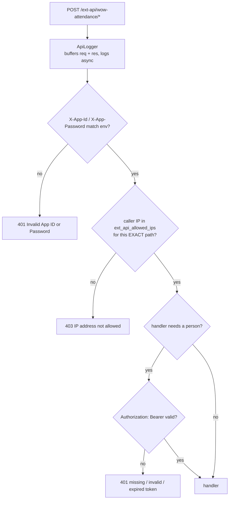

# Architecture — duerp-attendance as a separate service

This document explains the *shape* of the split. For what the endpoints
actually do, read [`wow_attendance.md`](wow_attendance.md); for how to cut over
from the monolith, read [`MIGRATION.md`](MIGRATION.md).

---

## Why it is its own process

The attendance module was ~2,900 lines inside `duerp-api`, alongside courses,
programs, departments, the student portal and LMS routes. Four properties made
it a bad fit for that process:

1. **Different load shape.** Attendance is a burst: everybody checks in within
   the same ten minutes, each request carrying a multi-megabyte image that gets
   decoded, downscaled, re-encoded and forwarded. That CPU and memory spike sat
   in the same process as ERP CRUD traffic, and the ERP degraded with it.
   Separate processes mean attendance can be scaled — or throttled, or
   restarted — without touching the ERP.
2. **Different failure domain.** Enroll and verify depend on an external AI
   platform and on DU's backend. Both are outside our control and both are
   *fail-closed* dependencies here. An AI platform outage should return 502 on
   `/verify` and change nothing else; it should not consume connections or
   worker threads that course endpoints need.
3. **Different release cadence.** The AI integration, the image pipeline and
   the geo-fence change far more often than the ERP CRUD does. Every one of
   those changes previously required redeploying the entire ERP.
4. **Different blast radius.** This service handles biometric images and
   location data. Isolating it gives it its own filesystem mount, its own
   process user, its own logs, and its own network exposure, instead of
   inheriting the ERP's.

## Why the database was *not* split

The tables live in the shared `ictcell` schema and stayed there. Splitting them
would have meant either duplicating identity data (`employees`, `lms_student`,
`lms_faculty`, `body`) or turning the geo-fence and the report joins into
cross-service calls. Both cost more than they are worth right now:

- `ictcell.wow_attendance_location_verify()` resolves `employees.emp_id ->
  employees.office -> body_building_mapping` in one query. Across a service
  boundary that becomes an RPC on the hot path of every check-in.
- The report functions join attendance records to `lms_student.name` /
  `lms_faculty.name` inside Postgres. Moving that to the application means N+1
  lookups against duerp-api.

So: **shared database, separate processes.** The tables this service owns and
writes are listed below; it only *reads* the identity tables.

```
                    ┌──────────────────────────┐
   clients ────────▶│ duerp-attendance :8083   │──▶ AI platform  (/enroll, /recognize, /delete)
   (mobile, kiosk)  │  /login                  │──▶ DU backend   (login, getByEmployeeId)
                    │  /ext-api/wow-attendance │
                    │  /uploads/wow_attendance │──▶ face images on disk
                    │                          │    (this crate's own uploads/;
                    │                          │     other /uploads/* is duerp-api's)
                    └────────────┬─────────────┘
                                 │
                          Postgres `ictcell`   ◀── shared
                                 │
                    ┌────────────┴─────────────┐
   ERP clients ────▶│ duerp-api :8080          │
                    │  courses, programs, LMS, │
                    │  student portal          │
                    └──────────────────────────┘
```

### Table ownership

| Table | Owner | This service |
|---|---|---|
| `wow_attendance_enrollments` | duerp-attendance | read + write |
| `wow_attendance_images` | duerp-attendance | read + write |
| `wow_attendance_records` | duerp-attendance | read + write |
| `wow_attendance_token_mismatch_record` | duerp-attendance | write (audit) |
| `buildings`, `body_building_mapping` | duerp-attendance | read + write (`mapping-save`) |
| `ext_api_allowed_ips`, `ext_api_call_logs` | shared | read / append |
| `employees`, `lms_student`, `lms_faculty`, `body` | duerp-api / DU sync | **read only** |

Nothing in duerp-api writes the `wow_attendance_*` tables, so there is no
write-conflict between the two processes.

---

## What is shared, and what that costs

Three things must stay in lockstep between the two services. Each is a
deliberate coupling, not an oversight:

| Shared | Why | What breaks if they drift |
|---|---|---|
| `DATABASE_URL` | one schema, see above | wrong data, or missing functions |
| `JWT_SECRET` | a token from **either** `/login` must work on **both** | clients get 401 after the split, at random, depending on which service minted the token |
| `EXT_APP_ID` / `EXT_APP_PASSWORD` | clients send one credential pair to both | 401 on half the API surface |

`JWT_SECRET` is the sharp one: rotating it is a **two-service, same-window**
operation. That is the price of keeping the split invisible to clients.

---

## Request pipeline

Every `/ext-api/*` request passes three gates before a handler runs. They are
registered in this order in `main.rs` and each one fails the request outright:



Two things to know about the gates:

- **The IP allow-list is exact-path, not prefix.** A new endpoint is
  unreachable until a row for its full path exists in `ext_api_allowed_ips`.
  `sql/000_ext_api_infra.sql` seeds all eight current paths with localhost.
- **`ApiLogger` buffers the request body** to log it, then reconstructs the
  payload for the handler. On multipart uploads the body is not JSON, so it is
  stored as a JSON string rather than parsed — the log row is still written.

## Trust boundaries

- **The AI platform is the only thing that compares faces.** This service never
  computes or stores an embedding. Enroll forwards images to `/enroll`; verify
  delegates identification to `/recognize`.
- **Enroll fails closed.** If the AI platform is unconfigured, unreachable, or
  returns anything other than success, the saved images are deleted and *no
  database row is written*. There is no "saved locally, sync later" path — a
  local enrollment the AI cannot match is worse than no enrollment.
- **The token holder must own the person id.** Enroll rejects an `id` that is
  not the token's `sub` (or the DU `user_id` behind it); verify rejects a face
  the AI recognized as somebody other than the token holder. Both rejections
  are written to `wow_attendance_token_mismatch_record` — that table is the
  impersonation-attempt audit trail, and it is the first place to look when
  investigating a disputed check-in.
- **`mapping-save` fails closed too.** With `WOW_ADMIN_KEY` unset the endpoint
  returns 503, never "open to everyone", and the key is compared in constant
  time.
- **Step logs are never HTTP-reachable.** They carry tokens, client IPs and
  employee ids. `main.rs` registers a 404 block on `/uploads/log` *before* the
  static file service to shadow them. This ordering is load-bearing and is
  pinned by `tests/uploads_log_block.rs` — if you reorder those two services,
  that test fails.

  Since 2026-09-01 `WOW_LOG_DIR` points at this crate's own
  `uploads/log` — inside the folder this service serves — so the block is
  load-bearing here, not merely defensive. duerp-api blocks its own log folder
  for the same reason. The admin viewer still shows both services' logs: it
  reads this folder too, via `WOW_ATTENDANCE_LOG_DIR` in duerp-api's `.env`.

## Known rough edges carried over

The port is deliberately verbatim, so these came with it and are unchanged:

- `ssl_image_verfiy` is misspelled in the URL. It is the live contract; fixing
  it is a client-visible change, not a refactor.
- `WOW_IDTYPE_FALLBACK` exists only because DU has no student-by-id endpoint,
  so no student can be confirmed as a student. Remove it when that endpoint
  ships.
- `WOW_ACCEPT_DU_TOKEN=true` accepts DU's own Laravel token, whose signature
  cannot be verified here. A forged one passes the token check — only the
  ext-api gate stands behind it. The step logs mark each such request
  (`LEGACY DU token`); set it to `false` once those stop appearing.