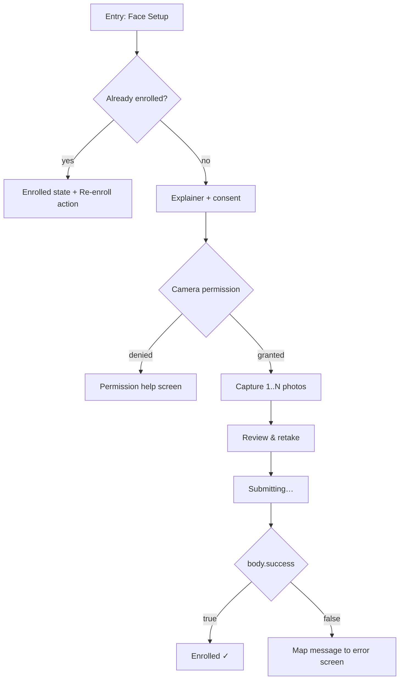
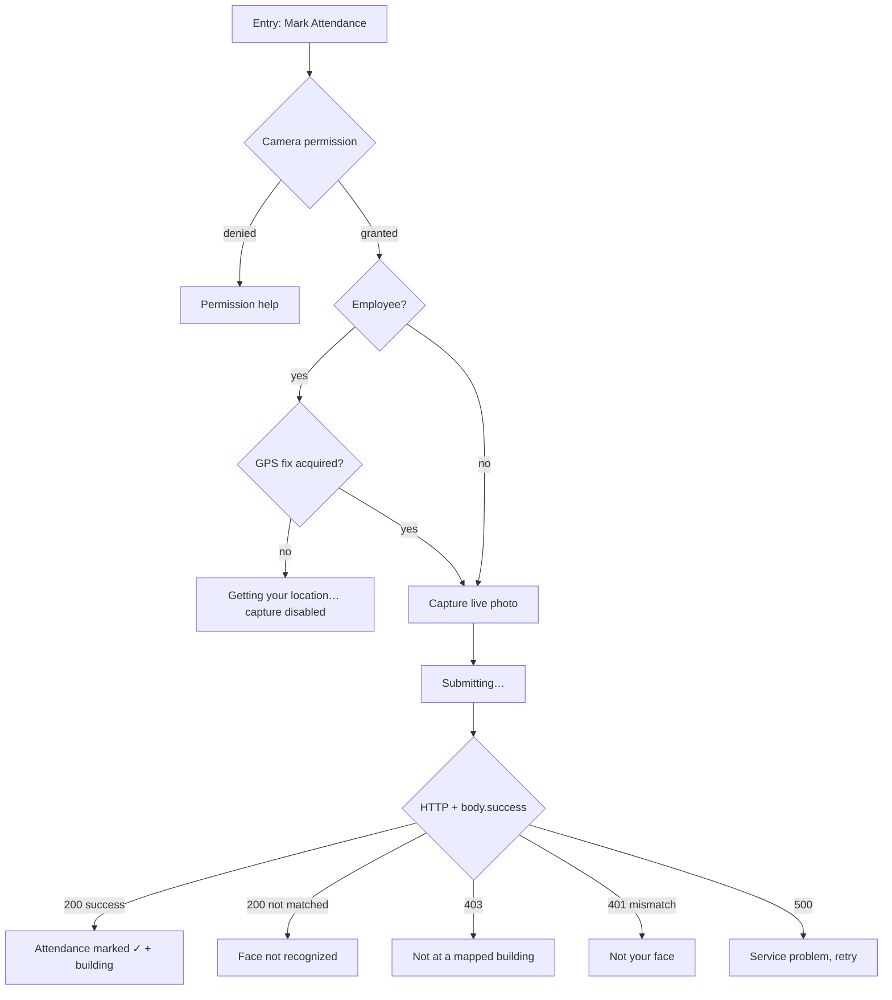

# UI design — face enrollment & attendance verification

Screen-by-screen design for the two user journeys the attendance service exists
to support:

| Journey | Endpoint | Who does it | How often |
|---|---|---|---|
| **Enroll** — register your face | `POST /ext-api/wow-attendance/enroll` | every user, once | once, plus re-enrollment |
| **Verify** — mark attendance | `POST /ext-api/wow-attendance/verify` | every user | twice a day |

The frontend is **React** — these screens live in `duerp-ui` (React 19 + Vite +
TypeScript, TailAdmin components). §1–§7 describe what each screen must do and
why, independent of framework; [§8](#8-react-implementation-duerp-ui) covers how
that lands in this specific React app, including four ways the existing shared
axios client will break these calls if reused as-is.

"Kiosk" and "mobile" below mean browser deployments of the same React app, not
separate native clients.

Plus the two admin screens built on the same API:

| Screen | Endpoint |
|---|---|
| **Enrolled list** — who has registered a face | `POST /ext-api/wow-attendance/enrolled` |
| **Attendance reports** — by date range, or by person | `POST /ext-api/wow-attendance/reports/{by-date,by-person}` |

And the geo-fence admin screen the verify flow depends on:

| Screen | Endpoint |
|---|---|
| **Building mapping** — where an office's staff may check in from | `POST /ext-api/wow-attendance/mapping-save` |

**Not covered here:** `ssl_image_verfiy`, which has no user-facing screen today.

For the wire-level contract see [`wow_attendance.md`](wow_attendance.md); for why
the service is separate, [`ARCHITECTURE.md`](ARCHITECTURE.md).

---

## Contents

1. [The one thing to get right](#1-the-one-thing-to-get-right)
2. [Shared foundations](#2-shared-foundations)
3. [Journey A — Enrollment](#3-journey-a--enrollment)
4. [Journey B — Verify & mark attendance](#4-journey-b--verify--mark-attendance)
5. [Journey C — Enrolled list](#5-journey-c--enrolled-list)
6. [Journey D — Attendance reports](#6-journey-d--attendance-reports)
7. [Journey E — Building mapping (geo-fence admin)](#7-journey-e--building-mapping-geo-fence-admin)
8. [React implementation (`duerp-ui`)](#8-react-implementation-duerp-ui)
9. [Copy deck](#9-copy-deck)
10. [Edge cases](#10-edge-cases)
11. [Accessibility & performance](#11-accessibility--performance)
12. [Open questions for product](#12-open-questions-for-product)

---

## 1. The one thing to get right

**A `200` does not mean the attendance was marked.** The verify endpoint returns
`200 OK` with `success: false` for the two most common real-world outcomes:

```json
{ "success": false, "matched": false, "message": "No matching enrolled person found" }
{ "success": false, "matched": false, "message": "Face did not match the requested person" }
```

A client that branches on the HTTP status alone will tell users their attendance
was recorded when it was not. **Branch on the `success` field of the body, on
every call, for both endpoints.**

The decision order that works:

```
1. transport failed (no response)        -> retryable network error screen
2. body.success === true                 -> success screen
3. body.success === false                -> map body.message via the tables below
4. no parseable body                     -> generic failure, offer retry
```

Status codes still matter for *classifying* a failure (`401` re-auth, `403`
blocked, `413` image too large), but they never confirm success.

---

## 2. Shared foundations

### 2.1 Every request carries three things

| Header | Value | If missing |
|---|---|---|
| `X-App-Id` / `X-App-Password` | App credentials, baked into the build | `401 Invalid App ID or Password` |
| `Authorization` | `Bearer <jwt>` from `POST /login` | `401 Missing or empty token` |
| `Content-Type` | `multipart/form-data` | request won't parse |

The caller's **IP must also be allow-listed** for the exact path, or the request
fails with `403 IP address not allowed for this endpoint`. This is per full path,
not per prefix — a kiosk on a new network needs an allow-list row added before it
can be used. **Surface this as an admin/setup problem, not a user error:** there
is nothing the person in front of the camera can do about it.

### 2.2 Identity is not chosen by the user

Both endpoints derive who you are from the **token**, never from a form field:

- **Enroll** — `id` must be the token holder's own. A valid token can only enroll
  its own face. There is no "enroll another person" flow, and the UI must not
  offer an id field the user can type into. Pre-fill `id` from the logged-in
  session and treat it as read-only.
- **Verify** — the person is whoever the AI platform recognizes. The optional
  `id` parameter only *narrows* it (see [modes](#42-two-modes)).

`id_type` (`Student` / `Employee`) is **not sent on enroll** — the backend
resolves it from DU. Students need the `X-Id-Type: Student` header, because DU
has no student lookup today. Set it from the session's known role.

### 2.3 Camera and image rules

These are the constraints that actually break real uploads:

| Rule | Value | What the UI must do |
|---|---|---|
| Max size | `WOW_MAX_IMAGE_MB`, default **5 MB** | Downscale before upload; over the limit is `413` |
| Accepted | JPEG, PNG, WEBP, BMP, HEIC/HEIF | Reject other types before the round-trip |
| **HEIC** | accepted but **not compressible server-side** | **Convert to JPEG on the client** |

> **The HEIC trap.** Android and iOS both capture HEIC by default. The server
> accepts it, but cannot decode it to shrink it — so an oversized HEIC is
> forwarded to the AI platform as-is and fails there, producing a confusing
> downstream error rather than a clean "too large". Always encode captures as
> **JPEG** before upload. This is the single most common integration bug on this
> API.

Practical capture settings: JPEG, longest edge ~1600 px, quality ~0.85. That
lands well under 5 MB and keeps enough detail for recognition.

### 2.4 Location — required for employees on verify

Employee check-ins are geo-fenced against the buildings mapped to their office.
The gate **fails closed**: no coordinates means no attendance.

Send `device_info` as a **JSON string** in a form field:

```json
{ "os": "15", "device": "V2246", "app_version": "2.0.4",
  "latitude": 23.7291368, "longitude": 90.3984877 }
```

Accepted key spellings — any one of each pair works:

| Latitude | Longitude |
|---|---|
| `device_lat`, `lat`, `latitude` | `device_long`, `long`, `lng`, `longitude` |

Values may be numbers or numeric strings.

**`0, 0` is rejected as "no fix", not as a location.** A phone that has not
acquired GPS commonly reports `0,0`, which is in the Gulf of Guinea. The UI must
therefore **wait for a real fix before enabling the capture button** — do not
submit with a placeholder. Show a "Getting your location…" state instead.

Students are recorded **without** a location check (no student location data
exists yet), so the UI should not block a student on GPS.

---

## 3. Journey A — Enrollment

### 3.1 Flow



### 3.2 Screens

**A1 · Entry — "Face Setup"**
Shows current state. Call `POST /ext-api/wow-attendance/check?person_id={id}`
first so the screen opens in the right state instead of guessing. Enrolled users
see when they enrolled and a **Re-enroll** action; unenrolled users see a primary
**Set up face** button.

**A2 · Explainer + consent**
This is biometric capture, so say plainly: photos are stored by the university
and sent to a recognition service, and enrolling is what lets you mark attendance
by camera. One screen, one **Continue**. Do not bury this in a terms link.

**A3 · Capture**
Guidance overlay: face centred, good light, no mask, eyes open. Capture **2–3
images** — the endpoint accepts one or many, and more angles measurably improve
later recognition. Show captured thumbnails as they accumulate.

**A4 · Review**
Thumbnails with per-image **Retake** and a **Submit** primary. Last chance before
upload; users routinely submit a blurred first frame otherwise.

**A5 · Submitting**
Blocking, non-cancellable, with an honest label — this call does a network
round-trip *plus* an AI platform round-trip and can take several seconds. Show
"Enrolling your face…", not a bare spinner. Disable back/close.

**A6 · Result**
On success: a confirmation naming the person and image count, then straight to
the attendance screen. `is_reenrollment: true` should say **"Face updated"**
rather than "Enrolled" — the user knows the difference.

### 3.3 Request mapping

```
POST /ext-api/wow-attendance/enroll?id={session.person_id}
Headers: Authorization, X-App-Id, X-App-Password, [X-Id-Type: Student]
Body (multipart):
  images      = file  (repeat the key per photo)
  device_info = JSON string
  name        = display name        (optional; falls back to id)
```

Note `id_type` is deliberately absent — see [§2.2](#22-identity-is-not-chosen-by-the-user).

### 3.4 Errors

| HTTP | `message` contains | UI treatment |
|---|---|---|
| 400 | `` `id` is required `` | Bug — session has no person id. Log out and back in. |
| 400 | `id_type could not be determined` | Send `X-Id-Type`. For a student build this is a client bug. |
| 401 | `Missing or empty token` / `Token has expired` | Silent refresh, then retry once; else re-login. |
| 401 | `token mismatch` | "You can only enroll your own face." Not retryable. |
| 413 | image too large | "Photo is too large" + retake. Should be unreachable if §2.3 is honoured. |
| **502** | `Face enrollment failed on the AI platform; nothing was saved` | **Retryable.** Say the service is temporarily unavailable and offer **Try again**. Nothing was saved — no partial state to clean up. |
| 500 | anything | Generic failure + retry. |

`502` is the one to design for properly: it is the expected outcome whenever the
AI platform is down, and it is fully recoverable by retrying later.

### 3.5 Re-enrollment

Same endpoint, no separate flow. Each call creates a new active enrollment
holding **only the images in that request** — it replaces rather than appends.
The UI must say so before submitting: *"This replaces your existing photos."*
The previous enrollment is retired, not deleted, and past attendance is kept.

---

## 4. Journey B — Verify & mark attendance

### 4.1 Flow



### 4.2 Two modes

| Mode | Send | Use when |
|---|---|---|
| **1:N identify** | just the image | Kiosk — anyone walks up, the platform identifies them |
| **1:1 guard** | image + `id` | Mobile app — the session already knows who you are |

Prefer **1:1 in the mobile app**: it converts a silent mis-identification into an
explicit "Face did not match the requested person", which is a far better failure.

### 4.3 Screens

**B1 · Entry**
Today's status (marked / not yet) and a large **Mark attendance** button. For
employees, resolve GPS in the background here so the camera screen is not gated
on it.

**B2 · Location gate (employees only)**
Only when there is no fix yet. "Getting your location…" with the capture action
**disabled** — never enabled with `0,0`. If location permission is denied, this
is a dead end until the user grants it; link into system settings.

**B3 · Capture**
Live camera, face guide, single shot. Auto-submit on capture — no review step.
Verification is a twice-daily action and a review screen doubles the taps for no
benefit.

**B4 · Submitting**
Same shape as A5, with "Checking your face…".

**B5 · Results** — five distinct outcomes, each needing its own screen:

| Outcome | Signal | Screen |
|---|---|---|
| **Marked** | `200`, `success: true` | ✓ Confirmation, time, and the **building name** from `location.building_name` — do not make them guess where it registered |
| **Not recognized** | `200`, `matched: false`, `No matching enrolled person found` | "We couldn't recognize your face." Offer **Try again** and a secondary route to re-enroll |
| **Wrong person** | `200`, `matched: false`, `Face did not match the requested person` | 1:1 only. "That doesn't look like you." Retry |
| **Out of area** | `403`, `verified: false` | See below — the most nuanced screen |
| **Not your face** | `401`, `token mismatch` | Recognized someone else's face on your token. Not retryable |

`location` sits at the **top level** of the response, a sibling of `data` — not
inside it:

```json
{ "success": true, "message": "Attendance marked",
  "data":     { "attendance_id": "uuid", "matched_at": "..." },
  "location": { "emp_id": "...", "emp_name": "...", "body_code": "...",
                "building_id": 4, "building_name": "Arts Building",
                "distance_m": 12.4, "radius_m": 50 } }
```

**The out-of-area screen** gets that same object on the `403`, and it is worth
rendering properly:

```json
{ "building_name": "Arts Building", "distance_m": 412.7, "radius_m": 50 }
```

Say *"You're about 410 m from Arts Building — you need to be within 50 m"*, not
"location failed". The user can act on the first and not on the second. Offer
**Try again** for when they walk closer.

Three `403` variants have no `location.building_name` and mean a **data problem,
not a user problem** — route these to support rather than to "try again":

| `message` | Meaning |
|---|---|
| `Employee not found` | No `employees` row for this id |
| `Employee has no office assigned` | `employees.office` is empty |
| `No building mapping found for this employee office` | Their office has no mapped building |

### 4.4 Request mapping

```
POST /ext-api/wow-attendance/verify[?id={session.person_id}]
Headers: Authorization, X-App-Id, X-App-Password
Body (multipart):
  image       = file            (or `images` / `file` / `photo`)
  device_info = JSON string     (REQUIRED for employees — lat/long)
```

The image may alternatively be a **base64 text field** of the same name; a
`data:image/jpeg;base64,` prefix is stripped automatically. Prefer the file part
— base64 inflates the payload by ~33% against a 5 MB ceiling.

### 4.5 Errors

| HTTP | `message` | UI treatment |
|---|---|---|
| 400 | `A live face image is required` | Client bug — the part name was wrong |
| 400 | `Invalid base64 image` | Client bug in the base64 path |
| 400 | `Device location is required` | GPS gate leaked; block capture until a fix (§2.4) |
| 401 | `token mismatch` | "Not your face." Not retryable |
| 403 | location messages | See §4.3 |
| 500 | `Face recognition failed: …` | Platform down. Retryable — offer **Try again** |
| 500 | `Could not determine id_type…` | Data problem; route to support |

---

## 5. Journey C — Enrolled list

Admin-facing. "Who has registered a face?" — the roster an administrator works
from before chasing people who have not enrolled.

`POST /ext-api/wow-attendance/enrolled?id_type={Student|Employee}&page=&limit=`

### 5.1 The constraint that shapes the screen

**`id_type` is required — there is no "all people" query.** The endpoint returns
students *or* employees, never both. So the screen opens on a segmented control,
not on an unfiltered table:

```
┌─────────────────────────────────────────────┐
│  Enrolled people                            │
│  ( Students ) ( Employees )   ← always one  │
│  ─────────────────────────────────────────  │
│  Name           ID        Photos  Enrolled  │
└─────────────────────────────────────────────┘
```

Persist the last-used tab. Do **not** build an "All" tab that fires two requests
and merges them — the two lists paginate independently and a merged page count
would be wrong.

### 5.2 Table

| Column | Source | Notes |
|---|---|---|
| Name | `name` | Primary column; resolved from `lms_student` / `lms_faculty` |
| ID | `id` | Monospace — these get copied into support tickets |
| Photos | `image_count` | How many faces are registered |
| Enrolled | `enrolled_at` | Relative ("3 weeks ago") with the exact date on hover |
| Status | `is_active` | See below |

**`is_active` is effectively always `true`.** Re-enrollment retires the previous
row and the list only surfaces current enrollments, so a status column shows one
value forever. Ship it as a filter-free label, or leave it out until inactive
rows are actually exposed — a column that never varies is noise.

### 5.3 Pagination

`total`, `page`, `limit` come back with every response; `limit` defaults to 20.
Standard server-side pagination — do not fetch everything and page client-side,
since the roster grows with the university.

**There is no search and no sort.** The endpoint takes only `id_type`, `page`
and `limit`. A search box on this screen would have to filter one page at a time,
which is worse than no search box because it looks like it searched everything.
If admins need to find one person, use the **Check enrolled** lookup instead
(§5.4) and raise the missing search as a backend change.

### 5.4 Single-person lookup

`POST /ext-api/wow-attendance/check?person_id={id}`

The right control for "is *this* person enrolled?" — an ID field and a result
card. Also what the [enrollment entry screen](#32-screens) calls to open in the
correct state.

Both outcomes are `200`; read the body:

| Body | Card |
|---|---|
| `enrolled: true` | ✓ Enrolled — photos, date, and `version` (`is_reenrollment` → "updated N times") |
| `enrolled: false` | Not enrolled — offer nothing else; an admin cannot enroll on someone's behalf ([§2.2](#22-identity-is-not-chosen-by-the-user)) |

A missing `person_id` is the only `400`.

---

## 6. Journey D — Attendance reports

```
POST /ext-api/wow-attendance/reports/by-date?from_date=&to_date=&id_type=&page=&limit=
POST /ext-api/wow-attendance/reports/by-person?person_id=&from_date=&to_date=&page=&limit=
```

Two endpoints, two genuinely different screens — do not try to serve both from
one table with a toggle.

| | By date range | By person |
|---|---|---|
| Endpoint | `reports/by-date` | `reports/by-person` |
| Answers | "Who checked in this week?" | "When did *this person* check in?" |
| Required | `from_date`, `to_date` | `person_id`, `from_date`, `to_date` |
| Optional filter | `id_type` (omit = both) | — |
| `name` | per row | once, at the top level |

Note the asymmetry: **by-date can span both students and employees; by-person
cannot filter by type** (it is already one person). And unlike the enrolled list,
`id_type` here is *optional* — omitting it returns both.

### 6.1 What the data will and will not support

Three properties of the stored records change what these screens should show.
All three are verified against the live table, not inferred:

| Field | Reality | Consequence for the UI |
|---|---|---|
| `matched` | **always `true`** — hardcoded at the call site | Not a column. Every stored row matched by construction |
| `confidence` | **always `1.0`** — `/recognize` returns no score | **Never render as a percentage.** A "100%" match-quality badge on every row is a lie the user will believe |
| `live_image` | a **server filesystem path**, in four shapes across environments | Not a URL. See §6.4 |

**Only successes are recorded.** A failed recognition, a geo-fence rejection and
a token mismatch all return without writing an attendance row, so these reports
can never show attempted-but-rejected check-ins. If someone asks for a "failed
attempts" report, that is a backend change, not a UI one. (Ownership mismatches
alone are audited, into `wow_attendance_token_mismatch_record`, which has no
endpoint today.)

### 6.2 By date range

```
┌──────────────────────────────────────────────────────────┐
│  Attendance report                                       │
│  From [2026-09-01] To [2026-09-02]  Type [All ▾]  Run    │
│  ────────────────────────────────────────────────────────│
│  Time      Name              ID          Type    Photo   │
│  16:04     Dr. Asif H. Khan  2002033008  Employee  🖼     │
└──────────────────────────────────────────────────────────┘
```

- **Dates are required** — keep **Run** disabled until both are set, rather than
  firing a request that 400s. Default to today→today.
- **Both dates are inclusive**, and the comparison is on the record's *date*, not
  its timestamp. "Today→today" returns everything from today. Say "inclusive" in
  the field labels; date-range off-by-ones are the most common report complaint.
- **Format is strictly `YYYY-MM-DD`.** Anything else returns
  `400 Invalid from_date/to_date; expected YYYY-MM-DD`. Use a date picker and
  send the ISO value; never send a locale-formatted string.
- **Type filter** is a three-way: All / Students / Employees, where "All" means
  *omit the parameter* rather than sending an empty string.
- Rows come **newest first**, already sorted server-side. Do not offer column
  sorting — it would only sort the current page.

### 6.3 By person

Same table, minus the Name and ID columns (both are in the header), plus the
person's name shown once from `data.name`. Reachable as a **drill-down from a
by-date row** as well as standalone — clicking a person in the range report
should open their own history for the same dates, carrying the range across.

Requires `person_id`; there is no "search by name". The screen therefore needs an
ID input, and pairing it with the [check-enrolled lookup](#54-single-person-lookup)
gives an admin a workable path from "who is this?" to "show their attendance".

### 6.4 Showing the captured photo

`live_image` is the path the file had **on the server at the time of capture**.
Across environments it takes at least four shapes:

```
/app/uploads/wow_attendance/live/uuid.jpg                        ← container
/var/www/.../duerp-api/uploads/wow_attendance/live/uuid.jpg      ← before the move
/var/www/.../duerp-attendance/uploads/wow_attendance/live/uuid.jpg
./uploads/wow_attendance/live/uuid.jpg                           ← relative default
```

**Do not use it as a URL.** To render a thumbnail, take the substring from
`/uploads/` onward and prefix the attendance service's public origin:

```
url = ORIGIN + path.slice(path.indexOf("/uploads/"))
```

Two caveats:

- Percent-escape the filename. Uploaded names routinely contain spaces
  (`WhatsApp Image 2026-07-09 at 12.54.26 PM.jpeg`), which break a raw ``.
- **Older rows will 404.** Records written before the 2026-08-19 uploads move
  point at a folder that no longer holds them. Render a placeholder on image
  error rather than a broken-image icon, and do not treat it as a failure — the
  attendance record is still valid.

Show the thumbnail as a small avatar that opens full size on click; the face is
the evidence behind the record, so make it reachable but not dominant.

### 6.5 Errors

| HTTP | `message` | UI treatment |
|---|---|---|
| 400 | `` `from_date` and `to_date` are required `` | Keep **Run** disabled until both are set |
| 400 | `Invalid from_date/to_date; expected YYYY-MM-DD` | Client bug — send the ISO value from the picker |
| 400 | `` `person_id`, `from_date` and `to_date` are required `` | By-person with a blank ID |
| 400 | `` `id_type` is required `` | Enrolled list with no tab selected — should be unreachable |
| 401 | token errors | Refresh once, then re-login ([§1](#1-the-one-thing-to-get-right)) |

An empty `list` with `total: 0` is **not** an error — show an empty state naming
the range ("No check-ins between 1 and 2 September"), with the filters still
visible so the user can widen them.

---

## 7. Journey E — Building mapping (geo-fence admin)

`POST /ext-api/wow-attendance/mapping-save`

This screen defines **where an office's staff are allowed to check in from**. It
is the thing that makes [§4's location gate](#24-location--required-for-employees-on-verify)
work: an office with no mapping means every employee in it is refused with
`No building mapping found for this employee office`. Getting this screen wrong
locks people out of attendance entirely, so it deserves more care than its size
suggests.

### 7.1 The constraint that defines this screen

**`mapping-save` is the only mapping endpoint. There is no list, no read, no
delete.** The screen is write-only and blind — it cannot show what is already
configured.

Everything below follows from that:

| Want | Possible today? |
|---|---|
| Table of existing mappings | ❌ no read endpoint |
| Building picker / dropdown | ❌ buildings cannot be listed |
| "Is this office already mapped?" | ❌ only discoverable by saving |
| Delete a mapping | ❌ — closest is `is_active: false` on an upsert |
| Confirm the fence works | ❌ not without a real check-in |

**Do not fake a list.** A read-only table stitched from client-side state after
each save will drift from the database the moment anyone else edits, and an admin
trusting a stale geo-fence table is worse than one who knows they are flying
blind. Build the form, make the **response** carry the whole feedback loop
(§7.5), and raise the missing read endpoint (§11).

### 7.2 Request — note it is JSON, not multipart

**Every other endpoint in this service takes `multipart/form-data`. This one
takes JSON.** A client that reuses the shared multipart helper here will fail to
parse.

```
POST /ext-api/wow-attendance/mapping-save
Content-Type: application/json
Authorization: Bearer <token>          ← a normal user token, still required
X-Admin-Key:   <shared admin key>      ← additionally required
X-App-Id / X-App-Password
```

```json
{
  "body_code":     "490010",
  "building_name": "Arts Building",
  "lat":  23.7291368,
  "long": 90.3984877,
  "radius": 50,
  "is_active": true
}
```

| Field | Required | Notes |
|---|---|---|
| `body_code` | Yes | The office. See §7.3 — this is the field people get wrong |
| `building_id` | one of | Existing building by id; wins if both are sent |
| `building_name` | one of | **Find-or-create**, matched case-insensitively on the trimmed name |
| `lat` / `long` | Yes | The building's centre, `-90..90` / `-180..180` |
| `radius` | No | Metres, default **50**, must be `> 0`. See §7.4 |
| `is_active` | No | `false` retires a mapping — the nearest thing to a delete |

### 7.3 `body_code` is the field that goes wrong

`body_code` is `ictcell.body.body_code` — a numeric-looking string like
**`490010`**. It is **not** `body.body_id`, which looks like `OES`. The mapping
joins to `employees.office`, which holds the *code*.

A wrong value **saves successfully** and silently never matches anyone. The API
catches it as a warning rather than an error, deliberately, so a mapping can be
staged before staff are assigned. That makes surfacing the warning (§7.5) the
only thing standing between an admin and a dead geo-fence.

Label the field **"Office code (e.g. 490010)"**, not "Body". Nobody outside the
database calls it a body.

### 7.4 Radius, and why the default matters

Radius is the tolerance around the building centre, in metres, defaulting to 50.

- **Below 20 m the API warns**, because consumer GPS drift alone is 3–50 m. A
  tight fence rejects people who are genuinely inside the building.
- Pre-fill **50**, and treat anything under 20 as needing confirmation rather
  than silently accepting it.
- Show it in context: "staff may check in within **50 m** of this point".

A map preview with a radius circle would make this obvious at a glance, and is
the single highest-value addition to this screen if a map component is available.
Failing that, show the lat/long to 6 decimal places and let the admin paste
coordinates from a maps app.

### 7.5 The response is the entire feedback loop

With no read endpoint, the save response is the only signal the admin ever gets.
Render **all** of it — do not collapse it to a toast.

```json
{
  "success": true,
  "message": "Mapping created",
  "data": {
    "mapping_id": 12, "body_code": "490010",
    "building_id": 4, "building_name": "Arts Building",
    "building_created": true,
    "lat": 23.7291368, "long": 90.3984877,
    "radius": 50, "is_active": true,
    "employee_count": 37
  },
  "warnings": []
}
```

Four fields carry information the admin cannot get any other way:

| Field | Why it matters |
|---|---|
| `message` | **`Mapping created` vs `Mapping updated`** — the only way to learn whether this office/building pair already existed. Show it prominently; an admin who meant to create and sees "updated" has just overwritten someone else's fence |
| `building_created` | `true` means the name did **not** match an existing building and a **new one was created**. Usually a typo. Call it out loudly: *"Created a new building 'Arts Buliding' — check the spelling"* |
| `employee_count` | How many staff this fence now governs. `0` is almost always a wrong `body_code` |
| `warnings[]` | Advisory, non-blocking. **Always render.** Empty array is the good case |

The two warnings the server can return:

| Warning | Meaning |
|---|---|
| `No employee has office=… — this mapping will never verify anyone` | Wrong `body_code` (§7.3), or the office has no staff yet |
| `radius …m is below 20m; GPS drift alone is 3-50m and will reject valid check-ins` | Fence too tight (§7.4) |

A save with warnings is a **success with a caveat**, not a failure. Use a
neutral/attention treatment, keep the result on screen, and offer **Edit** to fix
it immediately rather than making the admin retype everything.

### 7.6 Errors

| HTTP | `message` | UI treatment |
|---|---|---|
| **503** | `Admin operations are not configured on this server` | `WOW_ADMIN_KEY` is unset — the endpoint fails **closed**. Not retryable, not the admin's fault: "Geo-fence editing isn't enabled on this server." Route to IT |
| **403** | `Valid \`X-Admin-Key\` header required for this operation` | Wrong or missing admin key. Distinct from a normal `403` — do not send the user to re-login, the bearer token is fine |
| 401 | token errors | Ordinary session expiry; refresh then retry |
| 400 | `` `body_code` is required `` | Client-side validation should prevent this |
| 400 | `Either \`building_id\` or \`building_name\` is required` | Enforce in the form: one of the two must be filled |
| 400 | `Invalid building coordinates` | lat/long out of range — validate before sending |
| 400 | `` `radius` must be greater than 0 `` | Guard the input at `> 0` |
| 400 | `Building {id} not found` | An explicit `building_id` that does not exist |

Note the **two different `403`s** reachable from this screen: the IP allow-list
one from [§2.1](#21-every-request-carries-three-things) and the admin-key one
above. They need different copy — one is a device/network problem, the other is a
credentials problem.

### 7.7 Access model, and what it does not give you

Two credentials are required together: a normal **bearer token** *and* the shared
**`X-Admin-Key`**.

The key is shared, so it identifies *an* admin, not *which* admin — it cannot
drive per-user permissions, and the UI should not imply it can. The server does
record the token's user id alongside the write for attribution, visible in the
step log; if you need "who changed this fence", that log is where it lives.

Because the key is shared and long-lived, **do not ship it in a client bundle**
where end users can extract it. This screen belongs in an internal admin tool
whose backend holds the key, not in the attendance app itself.

---

## 8. React implementation (`duerp-ui`)

Stack as it stands: **React 19**, **Vite 6**, **TypeScript 5.7**,
**react-router-dom 7**, **axios 1.11**, TailAdmin components, Tailwind.

### 8.1 Four ways the shared axios client breaks these calls

`src/api/index.ts` is tuned for duerp-api. Reusing it for attendance fails in
four separate ways — **do not import it on these screens.**

| # | What it does | Why it breaks here |
|---|---|---|
| 1 | `baseURL: VITE_API_END_POINT` → **`:8080`** | Attendance is a **different service on `:8083`**. Every call would hit duerp-api and 404 |
| 2 | `headers: { "Content-Type": "application/json" }` | Enroll and verify are **multipart**. A hardcoded JSON content-type means **no `boundary`**, and the body never parses |
| 3 | 401 response interceptor calls `logoutFn()` | Attendance returns **401 for `token mismatch`** — "not your face". That is *not* session expiry. Reusing this client **logs the user out** when a face fails to match |
| 4 | attaches `Authorization` only | `X-App-Id` / `X-App-Password` are required on **every** attendance call, and `X-Admin-Key` on mapping-save |

Hazard 3 is the nastiest: it turns a recoverable "try again" into a forced
re-login, and it will look like a random logout bug in the field.

Give attendance its own instance:

```ts
// src/api/attendance.ts
import axios from "axios";

const attendanceApi = axios.create({
  baseURL: import.meta.env.VITE_ATTENDANCE_END_POINT, // e.g. http://127.0.0.1:8083
  // NOTE: no default Content-Type on purpose. axios infers it per request —
  // multipart (with the boundary) for FormData, JSON for a plain object, which
  // is exactly what enroll/verify and mapping-save respectively need. Setting a
  // default here is hazard 2 above; do not "helpfully" add one back.
  headers: {
    "X-App-Id": import.meta.env.VITE_EXT_APP_ID,
    "X-App-Password": import.meta.env.VITE_EXT_APP_PASSWORD,
  },
});

attendanceApi.interceptors.request.use((config) => {
  const token = localStorage.getItem("access_token");
  if (token) config.headers.set("Authorization", `Bearer ${token}`);
  return config;
});

// Deliberately NO global 401 -> logout. A 401 here may mean "not your face";
// each screen decides, per §1.
export default attendanceApi;
```

Add `VITE_ATTENDANCE_END_POINT` to `.env`. CORS is already permissive on the
attendance service, so cross-origin calls work without a proxy — though routing
`/ext-api/wow-attendance/` through the same nginx origin (as
[`DEPLOYMENT.md`](DEPLOYMENT.md) describes) avoids the preflight round-trip
entirely and is preferable in production.

### 8.2 Two hard browser constraints

**Secure context.** `getUserMedia` and `navigator.geolocation` both require
HTTPS **or** `localhost`. Chrome and Safari silently refuse on a plain-HTTP LAN
address. `.env` currently has:

```
VITE_SERVER_BASE_URL=http://192.168.55.243:8080
```

On that origin **the camera and GPS screens cannot work at all** — not a bug to
debug, a browser policy. Dev on `localhost`, and serve any shared/staging build
over HTTPS. This blocks §3 and §4 entirely, so settle it before building them.

**`VITE_*` env vars are inlined into the bundle** at build time and are readable
by anyone who opens devtools. So:

- `VITE_EXT_APP_ID` / `VITE_EXT_APP_PASSWORD` are *already* effectively public in
  any browser client — accept that, and rely on the IP allow-list as the real
  boundary.
- **`X-Admin-Key` must never be a `VITE_` var.** It is a shared admin secret
  ([§7.7](#77-access-model-and-what-it-does-not-give-you)). The mapping-save
  screen must call a **duerp-api-side proxy route** that holds the key
  server-side. A React screen cannot hold it safely.

### 8.3 Camera capture

```tsx
const videoRef = useRef<HTMLVideoElement>(null);
const streamRef = useRef<MediaStream | null>(null);

useEffect(() => {
  let cancelled = false;
  navigator.mediaDevices
    .getUserMedia({ video: { facingMode: "user", width: 1280, height: 720 } })
    .then((stream) => {
      if (cancelled) { stream.getTracks().forEach((t) => t.stop()); return; }
      streamRef.current = stream;
      if (videoRef.current) videoRef.current.srcObject = stream;
    })
    .catch(setPermissionError);

  // MUST stop the tracks, or the camera light stays on after navigation.
  return () => {
    cancelled = true;
    streamRef.current?.getTracks().forEach((t) => t.stop());
  };
}, []);
```

Capture to a JPEG blob:

```ts
const canvas = document.createElement("canvas");
canvas.width = video.videoWidth;
canvas.height = video.videoHeight;
canvas.getContext("2d")!.drawImage(video, 0, 0);
canvas.toBlob((blob) => onCapture(blob!), "image/jpeg", 0.85);
```

**A canvas capture sidesteps the HEIC problem entirely** — `toBlob` always
encodes JPEG, so [§2.3](#23-camera-and-image-rules)'s warning applies only to the
file-picker path. If you offer "upload a photo" as well as "take a photo", run
picked files through the same canvas re-encode rather than uploading them raw.

At 1280×720 / q0.85 a frame is ~150–250 KB, comfortably inside the 5 MB ceiling.

### 8.4 Geolocation

`getCurrentPosition` is one-shot and often returns a stale, low-accuracy fix
first. Use `watchPosition`, gate on accuracy, and remember that
[§2.4](#24-location--required-for-employees-on-verify) treats `0,0` as *no fix*:

```ts
const id = navigator.geolocation.watchPosition(
  (pos) => {
    const { latitude, longitude, accuracy } = pos.coords;
    if (latitude === 0 && longitude === 0) return;   // no fix yet
    setCoords({ latitude, longitude, accuracy });
  },
  setGeoError,
  { enableHighAccuracy: true, timeout: 15_000, maximumAge: 0 }
);
return () => navigator.geolocation.clearWatch(id);
```

Keep the capture button disabled until `coords` is set. `device_info` goes on the
`FormData` as a **JSON string**, not an object:

```ts
form.append("device_info", JSON.stringify({
  latitude: coords.latitude, longitude: coords.longitude,
  accuracy: coords.accuracy, app_version: __APP_VERSION__,
}));
```

### 8.5 Routing and permission gating

These screens slot into the existing guard in `App.tsx`. Three of the four
resource keys already exist in `duerp-db/access_control.sql`:

| Screen | Route | Resource key | Exists? |
|---|---|---|---|
| Mark attendance (§4) | `/attendance/mark` | `attendance.take` | ✅ |
| Attendance reports (§6) | `/attendance/reports` | `attendance.report.view` | ✅ |
| Geo-fence admin (§7) | `/attendance/buildings` | `attendance.settings` | ✅ |
| Enrolled list (§5) | `/attendance/enrolled` | `attendance.enrollment.view` | ❌ **new — add a seed row** |

```tsx
<Route element={<RequirePermission resource="attendance.report.view" />}>
  <Route path="/attendance/reports" element={<AttendanceReports />} />
</Route>
```

Face **enrollment** (§3) is self-service — every user enrolls their own face — so
it should sit behind authentication but **not** behind a permission key.

`RequirePermission` is client-side defence in depth only; the API is the real
gate. Note it guards the *screen*, not the data: the attendance API has no
per-role restriction of its own, so anyone with a valid token can call the report
endpoints directly regardless of this key.

### 8.6 Components to reuse

Reuse TailAdmin rather than introducing new primitives:

| Need | Use |
|---|---|
| Page shell | `common/PageMeta`, `common/PageBreadCrumb`, `common/ComponentCard` |
| Tables (§5, §6) | `ui/table` → `Table`, `TableHeader`, `TableBody`, `TableRow`, `TableCell` |
| Date range (§6) | `form/date-picker` — emit `YYYY-MM-DD`, never a locale string |
| Form fields (§7) | `form/Label`, `form/input/InputField`, `form/Select` |
| Image lightbox (§6.4) | `ui/modal` + the `useModal` hook |
| Toasts | `react-toastify` — but **never for the mapping-save result**, which must stay on screen ([§7.5](#75-the-response-is-the-entire-feedback-loop)) |

Follow `src/pages/Logs/` as the closest existing pattern: a typed `*Api.ts`
module beside the screen, server-side pagination, filters in local state.

### 8.7 Suggested layout

```
src/
  api/attendance.ts              ← the separate instance (§8.1)
  hooks/useCamera.ts             ← stream lifecycle + capture (§8.3)
  hooks/useGeolocation.ts        ← watchPosition + 0,0 guard (§8.4)
  pages/FaceAttendance/
    attendanceApi.ts             ← typed calls + response types
    EnrollFace.tsx               ← §3
    MarkAttendance.tsx           ← §4
    EnrolledList.tsx             ← §5
    AttendanceReports.tsx        ← §6
    BuildingMapping.tsx          ← §7
    components/CameraCapture.tsx
```

### 8.8 Response typing

Type the envelope so [§1](#1-the-one-thing-to-get-right) is enforced by the
compiler rather than by discipline — `success` is what decides, not the status
code:

```ts
type Envelope<T> =
  | ({ success: true } & T)
  | { success: false; message: string; [k: string]: unknown };
```

A discriminated union forces every call site to narrow on `success` before
touching the payload, which is exactly the mistake §1 warns about.

---

## 9. Copy deck

Backend `message` values are diagnostic, written for the step logs and for
support. **Do not show them verbatim.** Map them:

| Backend | Show the user |
|---|---|
| `No matching enrolled person found` | We couldn't recognize your face. Try again in better light. |
| `Face did not match the requested person` | That doesn't look like you. Please try again. |
| `Device location does not match any mapped building` | You're {distance} from {building}. Move within {radius} m and try again. |
| `token mismatch` | You can only mark attendance for yourself. |
| `Face enrollment failed on the AI platform; nothing was saved` | We couldn't set up your face right now. Nothing was saved — please try again. |
| `Invalid App ID or Password` / `IP address not allowed…` | Something's wrong with this device's setup. Contact IT. |
| `Employee has no office assigned` | Your office isn't set up for attendance yet. Contact HR. |
| `Admin operations are not configured on this server` | Geo-fence editing isn't enabled on this server. Contact IT. |
| `Valid \`X-Admin-Key\` header required for this operation` | You don't have permission to change geo-fences. |
| `No employee has office=… — this mapping will never verify anyone` | Saved, but no staff are assigned to office {code} — check the office code. |
| `radius …m is below 20m; GPS drift…` | Saved, but {radius} m is very tight. GPS is accurate to ~50 m, so valid check-ins may be rejected. |

Keep the raw `message` in client-side logs for support, and consider showing a
short correlation hint on failure screens — the server writes one step-log file
per call, named `{id}_{timestamp}.log`, which support can open through the admin
log viewer.

---

## 10. Edge cases

- **Token expiry mid-capture.** Refresh silently and retry once before showing a
  login screen. Losing a captured photo to a re-login is a bad experience.
- **Double submit.** Disable the action for the whole in-flight request; the
  endpoint is not idempotent and a second call records a second attendance row.
- **Offline.** Do **not** queue captures for later upload. Attendance is
  time-and-place sensitive and a delayed submission would be recorded at the
  wrong moment and pass a geo-fence the user has since left. Fail fast, ask them
  to retry on connection.
- **Kiosk with no session.** 1:N mode still needs a valid bearer token. A shared
  kiosk therefore needs its own service account, and the ownership check means
  that account can only mark **its own** attendance — so a shared kiosk is not
  supported by the current token model. Flag before building one.
- **Slow AI platform.** The service allows 30 s for the AI round-trip. Client
  timeouts should exceed that (≥ 45 s) or the user sees a timeout for a call that
  actually succeeded.

---

## 11. Accessibility & performance

- Camera screens need a non-visual path: announce capture state via screen reader
  and don't rely on a colour-only "face detected" cue.
- Every failure screen needs a keyboard/switch-reachable primary action.
- Compress off the main thread; a 5 MB JPEG resize will jank the UI otherwise.
- Show upload progress for the image part — on mobile data this is the slow leg.

---

## 12. Open questions for product

1. **Retry limit on verify?** Unlimited retries on a face that won't match is
   frustrating; after ~3 failures, offer re-enrollment or a manual fallback.
2. **Is there a manual fallback** when recognition fails repeatedly? Today a user
   whose face won't match has no way to mark attendance.
3. **Student geo-fencing** is not enforced. Intentional, or pending data?
4. **Kiosk token model** — see §10; needs a decision before a kiosk ships.
5. **Re-enrollment policy** — self-service, or approval-gated? It currently
   replaces the active enrollment with no review.
6. **No search or sort anywhere.** Neither the enrolled list nor the reports
   accept a name/ID search or a sort key, so an admin looking for one person must
   already know their id ([§5.3](#53-pagination)). This is the largest usability
   gap in the admin screens and it needs a backend change.
7. **A "failed attempts" report has no data behind it.** Rejections are not
   recorded ([§6.1](#61-what-the-data-will-and-will-not-support)). If attendance
   disputes need "they tried but were out of range", that has to be persisted
   first.
8. **`live_image` should probably be a URL, not a filesystem path.** Every client
   currently has to reconstruct it ([§6.4](#64-showing-the-captured-photo)), and
   each one will get the escaping or the origin subtly wrong. Returning a ready
   URL would delete a whole class of client bug.
9. **`matched` and `confidence` are constants** and arguably should not be in the
   response at all — they invite exactly the misleading UI called out in §6.1.
10. **Geo-fence mappings cannot be read back**
    ([§7.1](#71-the-constraint-that-defines-this-screen)). An admin cannot see
    which offices are mapped, cannot spot duplicates, and cannot audit a fence
    without triggering a real check-in. A `GET` for mappings and one for
    buildings would turn a blind form into a manageable screen, and would also
    make a building *picker* possible — removing the find-or-create typo risk
    that currently creates duplicate buildings.
11. **Mappings cannot be deleted**, only deactivated via `is_active: false` on an
    upsert — which requires already knowing the exact `body_code` + `building_id`
    pair, and there is no way to look that up (§7.1).
12. **HTTPS is a prerequisite, not a nice-to-have.** The camera and GPS screens
    cannot run on the current plain-HTTP LAN origin
    ([§8.2](#82-two-hard-browser-constraints)). Someone needs to own TLS for
    dev/staging before §3 and §4 can be built at all.
13. **`mapping-save` needs a server-side proxy.** A React client cannot hold
    `X-Admin-Key` safely, so the geo-fence screen depends on a duerp-api route
    that holds the key and forwards the call
    ([§8.2](#82-two-hard-browser-constraints)). That route does not exist yet.
14. **`attendance.enrollment.view` does not exist** as a resource key; the
    enrolled-list screen needs a seed row in `duerp-db/access_control.sql`
    ([§8.5](#85-routing-and-permission-gating)).
15. **`X-Admin-Key` is a shared secret**, so geo-fence edits cannot be attributed
    to a person through the API, and the key must never ship in a client bundle
    ([§7.7](#77-access-model-and-what-it-does-not-give-you)). If per-admin
    permissions are wanted, this needs to move onto the same role system the rest
    of the ERP uses.
