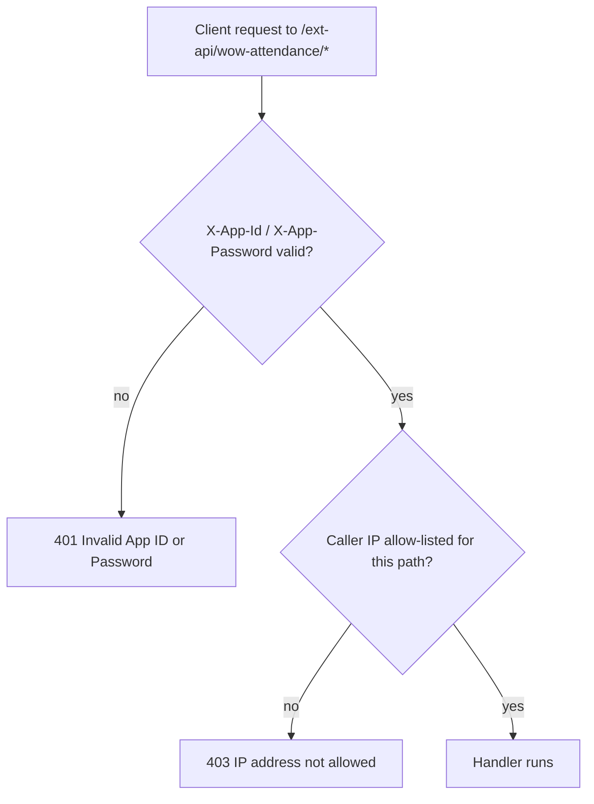
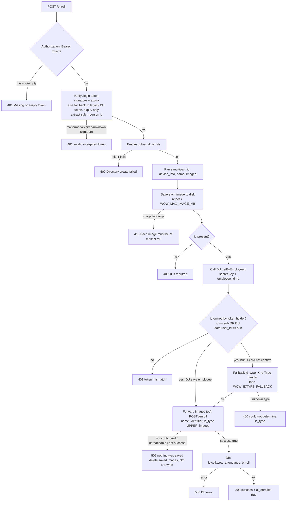
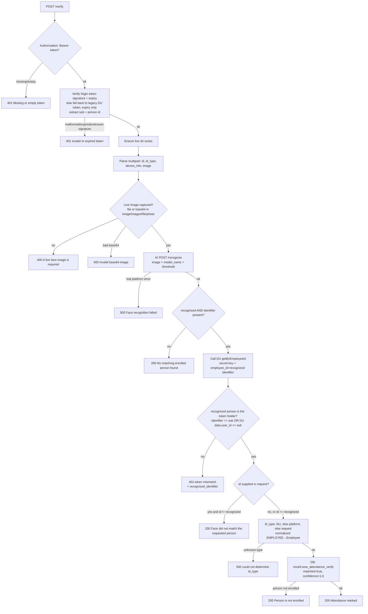
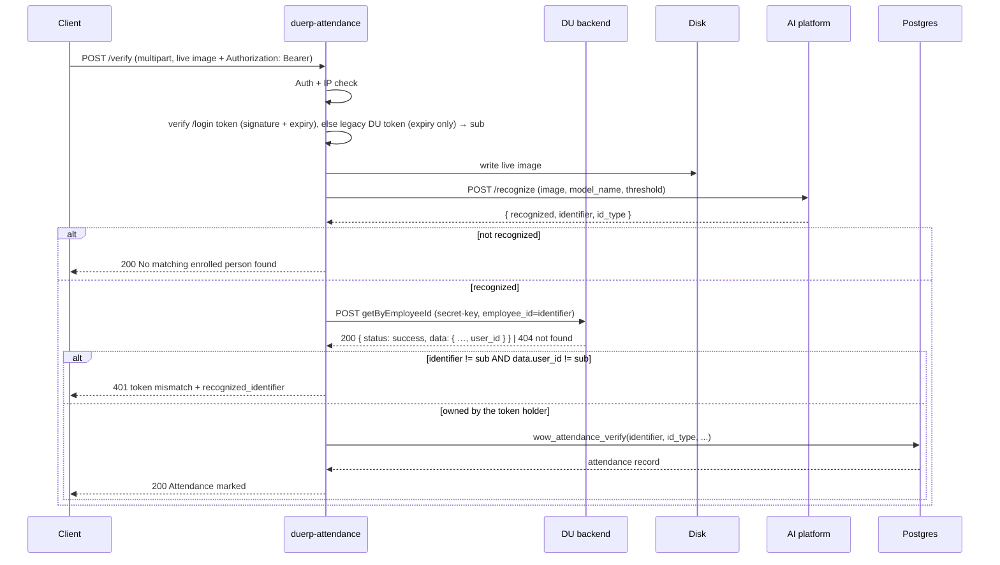

# WOW Attendance Module

Face-based attendance for students and employees. The module has two
responsibilities:

1. **Enrollment** — register one or more face images for a person. Images are
   stored locally **and** forwarded to an external AI platform so it can learn
   the face. The enrollment is written to the database **only after the AI
   platform confirms success**; otherwise it fails closed and nothing is saved.
2. **Verification / Attendance** — take a live photo, ask the AI platform to
   recognize who it is, and record an attendance entry.

This is the **endpoint reference**. For why attendance runs as its own service
and what it shares with duerp-api, see [`ARCHITECTURE.md`](ARCHITECTURE.md); for
running it, [`DEPLOYMENT.md`](DEPLOYMENT.md).

Source: `src/routes/wow_attendance.rs` (crate `duerp-attendance`, default `:8083`)
Stored procedures: `sql/001_wow_attendance.sql` (+ `002` geo-fence, `003` audit)
Postman: `docs/wow_attendance.postman_collection.json` (+ `docs/wow_attendance_postman.md`)

---

## Architecture

```
client ──multipart──▶ duerp-attendance (/ext-api/wow-attendance/*)
                          │
                          ├─▶ Postgres (ictcell.wow_attendance_* tables + functions)
                          │
                          └─▶ AI platform  (WOW_AI_BASE_URL)
                                 POST /enroll      ← learn a face
                                 POST /recognize   ← identify a live face
```

- **duerp-attendance** owns enrollment records, attendance records, and access control.
- **AI platform** owns the face embeddings and does the actual matching. The API
  never compares faces itself — enrollment forwards images to `/enroll`, and
  verification delegates identification to `/recognize`.

---

## Flow diagrams

> Rendered with Mermaid (GitHub, VS Code with a Mermaid extension, etc.).

### Request lifecycle (all endpoints)



### Enroll flow



### Verify flow



### Sequence — enroll

```mermaid
sequenceDiagram
    participant C as Client
    participant API as duerp-attendance
    participant DU as DU backend
    participant FS as Disk
    participant DB as Postgres
    participant AI as AI platform
    C->>API: POST /enroll (multipart + Authorization: Bearer)
    API->>API: Auth + IP check
    API->>API: verify /login token (signature + expiry), else legacy DU token (expiry only) → sub
    API->>FS: write image files (reject > WOW_MAX_IMAGE_MB)
    API->>DU: POST getByEmployeeId (secret-key, employee_id=id)
    DU-->>API: 200 { status: success, data: { …, user_id } } | 404 not found
    API->>API: owned? id == sub OR data.user_id == sub — else 401 token mismatch
    API->>API: employee → Employee; otherwise X-Id-Type / WOW_IDTYPE_FALLBACK
    API->>AI: POST /enroll (name, identifier, id_type, images)
    AI-->>API: { success, error }
    alt success:true
        API->>DB: wow_attendance_enroll(...)
        DB-->>API: enrollment record
        API-->>C: 200 success + ai_enrolled true
    else not success / not configured / unreachable
        API->>FS: delete saved images
        API-->>C: 502 nothing was saved + ai_error
    end
```

### Sequence — verify



---

## Access control

All endpoints live under the `/ext-api` scope and are wrapped by
`ExtAuthMiddleware` (`src/middleware/ext_auth_middleware.rs`). Every request
must pass **two** checks:

| Check        | How                                                                                 | Failure |
|--------------|-------------------------------------------------------------------------------------|---------|
| Credentials  | Headers `X-App-Id` and `X-App-Password` must equal `EXT_APP_ID` / `EXT_APP_PASSWORD` | `401 {"error":"Invalid App ID or Password"}` |
| IP allow-list| Caller IP must exist for the **exact** request path in `ictcell.ext_api_allowed_ips` (`is_active = true`) | `403 {"error":"IP address not allowed ..."}` |

> The IP check is per endpoint path. Add a row for each of
> `/ext-api/wow-attendance/enroll`, `/ext-api/wow-attendance/enrolled`,
> `/ext-api/wow-attendance/check`, `/ext-api/wow-attendance/reports/by-date`,
> `/ext-api/wow-attendance/reports/by-person`, and
> `/ext-api/wow-attendance/verify`.

---

## Configuration (`.env`)

| Variable           | Required | Purpose                                                        |
|--------------------|----------|----------------------------------------------------------------|
| `DATABASE_URL`     | yes      | Postgres connection                                            |
| `EXT_APP_ID`       | yes      | Expected `X-App-Id` header                                     |
| `EXT_APP_PASSWORD` | yes      | Expected `X-App-Password` header                              |
| `WOW_AI_BASE_URL`  | yes\*    | AI platform base URL, e.g. `http://103.221.255.12`            |
| `WOW_AI_API_KEY`   | yes\*    | Sent to the AI platform as the `x-api-key` header             |
| `WOW_AI_MODEL_NAME`| no       | Recognition model forwarded to `/recognize` (e.g. `ensemble`) |
| `WOW_AI_THRESHOLD` | no       | Optional recognition threshold forwarded to `/recognize`      |
| `WOW_UPLOAD_DIR`   | no       | Base upload dir (default `./uploads/wow_attendance`)          |
| `WOW_MAX_IMAGE_MB` | no       | Max size per uploaded image, in MB (default `5`; fractional allowed) |
| `SSL_API_ENDPOINT` | yes\*\*  | DU backend base URL; enroll/verify call `{SSL_API_ENDPOINT}getByEmployeeId` to authorize the person and resolve `id_type` |
| `WOW_IDTYPE_FALLBACK` | no    | `id_type` used when DU does not confirm an employee (see below) |
| `WOW_ACCEPT_DU_TOKEN` | no    | Also accept DU's legacy `access_token` (default `true`). Set to `false` once all clients send the `POST /login` token |

\*\* Required for **enroll** and **verify**. Both call DU's `getByEmployeeId`
(header `secret-key`, form `employee_id=<the person being enrolled/verified>`)
**once**, and that single answer settles two things: whether the person belongs to
the token holder, and their `id_type`.

Note the lookup is keyed on the **person id in the request** — *not* on the
token's `sub`, which for a legacy DU token is a different number entirely.

| DU answer | Owner? | `id_type` |
| --------- | ------ | --------- |
| `200 {"status":"success","data":{ …, "user_id": N }}` | yes if `N == sub`, or if the id **is** `sub` | `Employee` |
| `404 Employee not found` / `422` (id not 10 digits, e.g. a student id) | only if the id **is** `sub` | falls back ↓ |
| unreachable / other status | only if the id **is** `sub` | falls back ↓ |

<a id="user-id-link"></a>
**The `user_id` link.** `getByEmployeeId` returns the employee's DU `user_id`
alongside their `employee_id`:

```json
{ "status": "success",
  "data": { "employee_id": "2020111007", "employee_name_en": "…", "user_id": 45320 } }
```

That is what lets a caller on a **legacy DU token** act on their own employee id.
Such a token carries `sub = 45320` (the DU `user_id`) while enroll/verify work in
terms of `2020111007` (the `employee_id`) — the two ids look nothing alike, and DU
is the only thing that links them. Without this the caller would be rejected with
`token mismatch` on their own face. A `POST /login` token needs no link: its `sub`
**is** the employee id already.

> A DU **outage** therefore leaves only the direct `sub == id` match. Authorization
> fails closed — a legacy-token caller cannot act under their `emp_id` while DU is
> down — while `id_type` still falls back, so a plain self-enroll keeps working.

**Fallback:** DU has **no student-by-id endpoint yet**, so a non-employee cannot
be positively identified as a `Student`. Until it exists, anyone DU does not
confirm as an employee falls back to the `X-Id-Type: Student|Employee` request
header, then to the `WOW_IDTYPE_FALLBACK` env default; if neither yields a
recognized value, enroll returns `400`. **Note:** with `WOW_IDTYPE_FALLBACK=Employee`,
a student who sends no `X-Id-Type` header is recorded as `Employee` — the app
should send the header for students until the DU student lookup lands.

The endpoints stay protected by `ExtAuthMiddleware` (X-App-Id/X-App-Password + IP
allow-list). A lookup is skipped (no round-trip) when `sub` is not 10 digits,
since DU rejects such an id with a `422` anyway.

\* `WOW_AI_BASE_URL` / `WOW_AI_API_KEY` are effectively **required** for both
enroll and verify. If `WOW_AI_BASE_URL` is unset, **enroll fails closed**
(`502`, `"...nothing was saved"`, `ai_enrolled: false`) — no enrollment is
written to the database — and **verify** fails with
`"Face recognition failed: WOW_AI_BASE_URL not configured"`.

**Storage directories** (created automatically under `WOW_UPLOAD_DIR`):
- Enrolled images: `{WOW_UPLOAD_DIR}/enrolled/`
- Live verify images: `{WOW_UPLOAD_DIR}/live/`

The default `./uploads/wow_attendance` is relative to the process working
directory — it works locally and, in the container (working dir `/app`),
resolves to `/app/uploads/wow_attendance`. Set `WOW_UPLOAD_DIR` to an absolute
path to override. The process user must have write permission to it; otherwise
requests fail with `Directory create failed: Permission denied (os error 13)`.

---

## Common request rules

- `Content-Type: multipart/form-data` for all endpoints.
- **`Authorization: Bearer <token>` is required on every endpoint.** A missing or
  empty token returns `401`. It is no longer accepted as a `token` form field.
  Two token sources are accepted during the migration window:

  | Token | `sub` | Checked | Status |
  | ----- | ----- | ------- | ------ |
  | **This service's `POST /login` token** (preferred) | person id — 10-digit `emp_id` for staff, DU `user_id` for students | signature (`JWT_SECRET`) **and** expiry | ✅ use this |
  | **DU's Laravel `access_token`** (`local.duwebadmin.com/api/login`) | DU `user_id` (e.g. `45320`) | expiry only — **signature cannot be verified** | ⚠️ legacy, being removed |

  > **Migrate to the `POST /login` token.** DU's token is signed with DU's own
  > secret, which this service does not hold, so a **forged one passes** — only
  > `ExtAuthMiddleware` (X-App-Id/X-App-Password + IP allow-list) stands behind
  > it. Its `sub` is the DU `user_id`, which `getByEmployeeId` rejects with
  > `422 "must be 10 digits"`, so a caller on a DU token is **never confirmed
  > against DU** and always lands on the `id_type` fallback. It also means `id`
  > must be that `user_id` — an employee cannot enroll under their `emp_id`.
  >
  > Set `WOW_ACCEPT_DU_TOKEN=false` to turn the legacy path off once every client
  > has moved. Each request still arriving on one is flagged in the step log as
  > `LEGACY DU token` — grep for it to find who is left.
- `id` / `id_type` may be sent as **query params or form fields** (some clients
  drop the query string on multipart POSTs, so form fields are accepted too) —
  **except on `enroll`, where `id_type` is resolved from DU's answer about `id`**
  (see below) and any `id_type` in the request is ignored.
- `id_type` is `Student` or `Employee`. For `Employee`, `id` is the faculty
  `emp_id`; for `Student`, `id` is `lms_student.id`.

---

## 1. Enroll

`POST /ext-api/wow-attendance/enroll?id={id}`

Saves images locally, then forwards them to the AI platform's `POST /enroll` for
learning. **The enrollment record is written to the database only after the AI
platform confirms success** (`success: true`). If the AI platform is not
configured, is unreachable, or does not confirm success, the request **fails
closed** (`502`, saved images deleted, nothing written to the DB).

**`id` must be the token holder's own** — a valid token can only enroll its own
face. After the token itself is validated (signature + expiry; see Common request
rules), the backend calls DU's `getByEmployeeId` on the **`id` being enrolled**
and accepts it when **either** holds:

- `id` **is** the token's `sub` — a `POST /login` token carries the person id
  directly; **or**
- DU reports that employee `id` has **`user_id == sub`** — the
  [`user_id` link](#user-id-link) that lets a legacy DU token enroll under its
  employee id.

Otherwise → `401 token mismatch`.

`id_type` (`Student` / `Employee`) comes from that **same** lookup — it is never
read from the query/body. DU confirming `id` as an employee means `Employee`;
anything else (every student, since DU has no student lookup) falls back to the
`X-Id-Type` header and then `WOW_IDTYPE_FALLBACK` (see Environment above). If no
`id_type` can be determined → `400`.

A DU lookup that fails does **not** by itself fail the request: `id_type` still
falls back, so a DU outage cannot block a plain self-enroll. It does mean the
`user_id` link is unavailable, so a legacy-token caller cannot enroll under their
`emp_id` until DU is back.

**Re-enroll = versioning.** Re-enrollment uses this **same** endpoint. Each call
always creates a **new active enrollment row** holding only the images supplied
in that request. Any previous active enrollment for the same `person_id` +
`id_type` is retired (`is_active = false`) rather than deleted — its images and
past attendance records are kept for history. So `wow_attendance_enrollments`
always has exactly one active row per person reflecting the **latest**
enrollment, and `check`, `enrolled`, and `verify` only ever see that latest row.
The returned `enrollment_id` changes on every re-enroll.

The new row records the re-enroll lineage:

- `version` — `1` for a first enrollment, incremented (`2`, `3`, …) on each
  re-enroll.
- `previous_enrollment_id` — the `id` of the row this re-enroll superseded
  (`null` for a first enrollment), forming a chain back through every version.

The response reflects this with `version`, `is_reenrollment`, and
`previous_enrollment_id`, and the `message` is `"Re-enrolled successfully"`
(vs `"Enrolled successfully"`) when it was a re-enroll.

**Headers**

| Header          | Required | Description                                             |
|-----------------|----------|---------------------------------------------------------|
| `Authorization` | Yes      | `Bearer <jwt>` — this service's `POST /login` token (signature + expiry verified); a legacy DU token is still accepted, expiry only. Its `sub` must own `id` (directly, or via DU's `user_id`) |
| `X-Id-Type`     | No       | `Student` \| `Employee` — fallback used only when DU does not confirm an employee (required for students today) |
| `X-App-Id` / `X-App-Password` | Yes | App credentials (see Access control)                     |

**Body — form-data**

| Field         | Type   | Required | Description                                            |
|---------------|--------|----------|--------------------------------------------------------|
| `id`          | Text   | Yes\*    | Person id (or query param)                             |
| `device_info` | Text   | No       | JSON string, e.g. `{"device":"Android","os":"14"}`     |
| `name`        | Text   | No       | Display name sent to the AI platform (falls back to `id`)|
| `images`      | File[] | Yes      | One or more face images; repeat the key for multiple. Each ≤ `WOW_MAX_IMAGE_MB` (default 5 MB), else `413` |

\* `id` is required — query param or form field. `id_type` is **not** accepted
here; it comes from the token. Any `token` form field is ignored.

**What is sent to the AI platform** (`POST {WOW_AI_BASE_URL}/enroll`, header
`x-api-key`):

| AI field     | Value                                              |
|--------------|----------------------------------------------------|
| `name`       | `name` form field, or `id` if omitted              |
| `identifier` | `id`                                               |
| `id_type`    | `id_type` (from the token) **upper-cased** (`Employee` → `EMPLOYEE`)|
| `images`     | the uploaded image bytes                           |

**Response** (DB enroll result, annotated with the AI outcome)

```json
{
  "success": true,
  "message": "Re-enrolled successfully",
  "data": {
    "id": "EMP-001",
    "id_type": "Employee",
    "enrolled_image_count": 2,
    "enrollment_id": "uuid",
    "version": 2,
    "is_reenrollment": true,
    "previous_enrollment_id": "uuid-of-retired-row"
  },
  "ai_enrolled": true
}
```

If the AI platform does not confirm success (not configured, unreachable, or
`success` is not `true`), **nothing is written to the database**, the saved
images are deleted, and the endpoint returns `502`:

```json
{
  "success": false,
  "ai_enrolled": false,
  "ai_error": "request failed: ...",
  "message": "Face enrollment failed on the AI platform; nothing was saved"
}
```

**cURL**

```bash
curl -X POST \
  "http://localhost:8083/ext-api/wow-attendance/enroll?id=EMP-001" \
  -H "X-App-Id: $APP_ID" -H "X-App-Password: $APP_PASSWORD" \
  -H "Authorization: Bearer eyJhbGci..." \
  -F "name=Alice" \
  -F 'device_info={"device":"Android","os":"14"}' \
  -F "images=@photo1.jpg" \
  -F "images=@photo2.jpg"
```

> `id_type` is resolved from DU's answer about `id` (via `getByEmployeeId`, with
> the `X-Id-Type` header / `WOW_IDTYPE_FALLBACK` as fallback), so it is **not**
> passed as a query param or form field here.

---

## 2. Enrolled List

`POST /ext-api/wow-attendance/enrolled?id_type={Student|Employee}`

**Body — form-data**

| Field     | Type | Required | Value          |
|-----------|------|----------|----------------|
| `id_type` | Text | Yes\*    | `Student` / `Employee` (or query param) |
| `page`    | Text | No       | default `1`    |
| `limit`   | Text | No       | default `20`   |

> Requires the `Authorization: Bearer <token>` header (see Common request rules).

**Response**

```json
{
  "success": true,
  "data": {
    "id_type": "Student",
    "total": 120,
    "page": 1,
    "limit": 20,
    "list": [
      {
        "id": "550e8400-...",
        "name": "John Doe",
        "enrollment_id": "uuid",
        "enrolled_at": "2026-06-01T10:00:00Z",
        "image_count": 3,
        "is_active": true
      }
    ]
  }
}
```

---

## 2b. Check Enrolled

`POST /ext-api/wow-attendance/check?person_id={person_id}`

Returns whether a person has an **active** enrollment, looked up by `person_id`
in `ictcell.wow_attendance_enrollments`. Read-only — it never calls the AI
platform and never writes. When several active enrollments exist for the same
`person_id`, the most recent one (`enrolled_at DESC`) is returned.

**Body — form-data** (`person_id` may also be sent as a query param)

| Field       | Type | Required | Description                                       |
|-------------|------|----------|---------------------------------------------------|
| `person_id` | Text | Yes\*    | Student/employee id (or query param; alias `id`)  |

\* required somewhere — query param or form field. Also requires the
`Authorization: Bearer <token>` header (see Common request rules).

**Response — enrolled**

```json
{
  "success": true,
  "enrolled": true,
  "message": "Person is enrolled",
  "data": {
    "id": "2002033008",
    "id_type": "Employee",
    "enrollment_id": "0b5ede8e-8b02-4d18-a294-9061a15e4dc6",
    "enrolled_at": "2026-06-21T11:28:38.680467+06:00",
    "image_count": 3,
    "is_active": true,
    "version": 2,
    "is_reenrollment": true,
    "previous_enrollment_id": "uuid-of-retired-row"
  }
}
```

**Response — not enrolled**

```json
{
  "success": false,
  "enrolled": false,
  "message": "Person is not enrolled",
  "data": { "id": "UNKNOWN-123" }
}
```

> `success` mirrors the result: `true` when the person is enrolled, `false` when
> not. The `enrolled` flag carries the same value for explicitness. HTTP status
> is `200` in both cases (a missing `person_id` is the only `400`).

**cURL**

```bash
curl -X POST \
  "http://localhost:8083/ext-api/wow-attendance/check?person_id=2002033008" \
  -H "X-App-Id: $APP_ID" -H "X-App-Password: $APP_PASSWORD" \
  -H "Authorization: Bearer eyJhbGci..."
```

---

## 2c. Attendance Report — by date range

`POST /ext-api/wow-attendance/reports/by-date?from_date={YYYY-MM-DD}&to_date={YYYY-MM-DD}`

Lists attendance records from `ictcell.wow_attendance_records` whose `created_at`
**date** falls within `[from_date, to_date]` inclusive, newest first, paginated.
Each record's person name is resolved from `lms_student` / `lms_faculty`.

**Body — form-data** (all fields may also be sent as query params)

| Field       | Type | Required | Description                                  |
|-------------|------|----------|----------------------------------------------|
| `from_date` | Text | Yes      | Start date, `YYYY-MM-DD` (compared on `created_at::date`) |
| `to_date`   | Text | Yes      | End date, `YYYY-MM-DD`, inclusive            |
| `id_type`   | Text | No       | Filter to `Student` / `Employee` (omit = both) |
| `page`      | Text | No       | default `1`                                  |
| `limit`     | Text | No       | default `20`                                 |

**Response**

```json
{
  "success": true,
  "data": {
    "from_date": "2026-06-01",
    "to_date": "2026-06-21",
    "id_type": null,
    "total": 2,
    "page": 1,
    "limit": 20,
    "list": [
      {
        "record_id": "uuid",
        "id": "2002033008",
        "id_type": "Employee",
        "name": "Dr. Muhammad Asif Hossain Khan",
        "matched": true,
        "confidence": 0.95,
        "live_image": "/app/uploads/wow_attendance/live/uuid.jpg",
        "device_info": { "device": "Android" },
        "enrollment_id": "uuid",
        "created_at": "2026-06-21T16:04:27.518726+06:00"
      }
    ]
  }
}
```

**cURL**

```bash
curl -X POST \
  "http://localhost:8083/ext-api/wow-attendance/reports/by-date?from_date=2026-06-01&to_date=2026-06-21" \
  -H "X-App-Id: $APP_ID" -H "X-App-Password: $APP_PASSWORD" \
  -H "Authorization: Bearer eyJhbGci..."
```

---

## 2d. Attendance Report — by person

`POST /ext-api/wow-attendance/reports/by-person?person_id={id}&from_date={YYYY-MM-DD}&to_date={YYYY-MM-DD}`

Same as the by-date report but scoped to a single `person_id`. The person's
resolved `name` is returned once at the top level; each list item omits the
repeated `id`/`name`.

**Body — form-data** (all fields may also be sent as query params)

| Field       | Type | Required | Description                                  |
|-------------|------|----------|----------------------------------------------|
| `person_id` | Text | Yes      | Student/employee id (alias `id`)             |
| `from_date` | Text | Yes      | Start date, `YYYY-MM-DD`                      |
| `to_date`   | Text | Yes      | End date, `YYYY-MM-DD`, inclusive            |
| `page`      | Text | No       | default `1`                                  |
| `limit`     | Text | No       | default `20`                                 |

**Response**

```json
{
  "success": true,
  "data": {
    "id": "2002033008",
    "name": "Dr. Muhammad Asif Hossain Khan",
    "from_date": "2026-06-14",
    "to_date": "2026-06-21",
    "total": 2,
    "page": 1,
    "limit": 20,
    "list": [
      {
        "record_id": "uuid",
        "id_type": "Employee",
        "matched": true,
        "confidence": 0.95,
        "live_image": "/app/uploads/wow_attendance/live/uuid.jpg",
        "device_info": { "device": "Android" },
        "enrollment_id": "uuid",
        "created_at": "2026-06-21T16:04:27.518726+06:00"
      }
    ]
  }
}
```

**cURL**

```bash
curl -X POST \
  "http://localhost:8083/ext-api/wow-attendance/reports/by-person?person_id=2002033008&from_date=2026-06-01&to_date=2026-06-21" \
  -H "X-App-Id: $APP_ID" -H "X-App-Password: $APP_PASSWORD" \
  -H "Authorization: Bearer eyJhbGci..."
```

---

## 3. Verify & Mark Attendance

`POST /ext-api/wow-attendance/verify`
`POST /ext-api/wow-attendance/verify?id={id}` (optional 1:1 guard)

Captures the live photo, calls the AI platform's `POST /recognize` to identify
the person, then records attendance for the recognized person. **Only the live
image is required** — `id` and `id_type` are optional, because the platform
returns the matched person's `identifier` and `id_type`.

**Body — form-data**

| Field         | Type        | Required | Description                                  |
|---------------|-------------|----------|----------------------------------------------|
| `id`          | Text        | No       | If present, the recognized person must match it (1:1 guard) |
| `id_type`     | Text        | No       | Fallback only, used if the platform omits it  |
| `device_info` | Text        | No       | JSON string                                  |
| `image`       | File / Text | Yes      | The live face photo (see input formats below). Max `WOW_MAX_IMAGE_MB` (default 5 MB), else `413` |

> Requires the `Authorization: Bearer <token>` header (see Common request
> rules). The token is stored on the attendance record; it is no longer read
> from a `token` form field.

**The recognized face must be the token holder's** — the same ownership check as
Enroll, applied to the identifier the AI platform returns instead of a supplied
`id`. Once the face is recognized, DU's `getByEmployeeId` is called on that
identifier and the request proceeds when **either** holds:

- the recognized identifier **is** the token's `sub`; **or**
- DU reports that employee has **`user_id == sub`** — the
  [`user_id` link](#user-id-link), which is what lets a legacy DU token
  (`sub = 45320`) mark attendance for a face the platform recognizes as
  `2020111007`.

Otherwise → `401 token mismatch` (with `recognized_identifier` in the body), so a
valid token can only ever mark **its own** attendance.

`id_type` for the attendance record comes from that same lookup: DU's answer wins,
then the platform's own `id_type`, then the request's.

### Live image input formats

The live photo field may be named **`image`, `images`, `file`, or `photo`**, and
may be supplied either way:

- **As a file upload** (a part with a filename).
- **As a base64 string in a Text field** of the same name. A
  `data:image/jpeg;base64,...` data-URL prefix is accepted and stripped
  automatically. Invalid base64 → `400 {"message":"Invalid base64 image: ..."}`.

### Modes

| Mode          | Request                              | Behaviour                                                                 |
|---------------|--------------------------------------|--------------------------------------------------------------------------|
| 1:N identify  | just `image`                         | Records attendance for whoever `/recognize` returns.                      |
| 1:1 guard     | `id` supplied                        | Same, but rejects if the recognized `identifier` ≠ requested `id`.        |

The `id_type` returned by the AI platform is **normalized** back to the DB
casing (`EMPLOYEE` → `Employee`, `STUDENT` → `Student`) before recording; if it
can't be normalized, the request's `id_type` is used.

> `/recognize` returns no numeric score, so a successful match is recorded with
> `confidence = 1.0`.

**Response — match**

```json
{
  "success": true,
  "matched": true,
  "message": "Attendance marked",
  "data": {
    "id": "EMP-001",
    "id_type": "Employee",
    "attendance_id": "uuid",
    "matched_at": "2026-06-17T09:30:00Z",
    "confidence": 1.0
  }
}
```

**Response — not recognized**

```json
{
  "success": false,
  "matched": false,
  "message": "No matching enrolled person found",
  "live_image": "/app/uploads/wow_attendance/live/uuid.jpg"
}
```

**Response — recognized, but not the requested `id`**

```json
{
  "success": false,
  "matched": false,
  "message": "Face did not match the requested person",
  "recognized_identifier": "EMP-002",
  "live_image": "/app/uploads/wow_attendance/live/uuid.jpg"
}
```

**Response — recognized person isn't enrolled locally** (from the DB function)

```json
{
  "success": false,
  "matched": false,
  "message": "Person is not enrolled",
  "data": { "id": "EMP-001", "id_type": "Employee" }
}
```

**cURL (1:N identify)**

```bash
curl -X POST \
  "http://localhost:8083/ext-api/wow-attendance/verify" \
  -H "X-App-Id: $APP_ID" -H "X-App-Password: $APP_PASSWORD" \
  -H "Authorization: Bearer eyJhbGci..." \
  -F "image=@live_capture.jpg"
```

---

## AI platform contract

Base URL `WOW_AI_BASE_URL`, auth header `x-api-key: $WOW_AI_API_KEY`.
(Interactive docs: `{WOW_AI_BASE_URL}/docs`, spec: `/api-doc/openapi.json`.)

**`POST /enroll`** — multipart `name`, `identifier`, `id_type`, `images[]`
→ `{ "success": true, "error": null }`

**`POST /recognize`** — multipart `image` (+ optional `model_name`, `threshold`)
→ `{ "recognized": true, "name": "...", "identifier": "...", "id_type": "...", "error": null }`

### Re-enrollment behaviour (verified against the live platform)

The platform keys a person by **`identifier`** (one person per identifier — an
upsert, not a new record). Each `POST /enroll` for an existing identifier
**appends** new face embeddings to that person and never clears the old ones:
`embedding_count` keeps growing and `updated_at` advances, while `created_at`
stays fixed. (Observed: identifier `2017025022` had 10 embeddings across four
separate enroll sessions.)

> **Kept in sync with the DB versioning model.** The DB side replaces a
> person's images on re-enroll (old enrollment retired, new active row with only
> the new images — see [§1 Enroll](#1-enroll)). Because the platform otherwise
> *appends* embeddings, `ai_enroll` first deletes the existing person record for
> the identifier (`ai_delete_person`: `GET /persons` → match `identifier` +
> `id_type` → `DELETE /persons/{id}`) and then re-enrolls with the new images,
> so the platform ends up holding only the latest images. This cleanup is
> **best-effort**: if the lookup/delete fails it is logged and the enroll still
> proceeds (the platform would then append rather than replace).

**Person / embedding management endpoints** (use these to clean up old data):

| Method | Path | Purpose |
|--------|------|---------|
| `GET`    | `/persons` | List all persons (`id` uuid, `identifier`, `embedding_count`, timestamps). The only way to map an `identifier` → person `id`. |
| `GET`    | `/persons/{id}` | One person's summary. |
| `DELETE` | `/persons/{id}` | Delete the person and all their embeddings. |
| `GET`    | `/persons/{id}/embeddings` | List a person's embedding ids + `created_at`. |
| `DELETE` | `/persons/{person_id}/embeddings/{embedding_id}` | Delete a single embedding. |

The "replace on re-enroll" flow is implemented in `ai_enroll` /
`ai_delete_person` (`src/routes/wow_attendance.rs`): look up the person via
`GET /persons` (match `identifier` + `id_type`), `DELETE /persons/{id}`, then
`POST /enroll` with the new images.

---

## Database

### Tables (schema `ictcell`)

- `wow_attendance_enrollments` — one row per enrolled person/version
  (`person_id`, `id_type`, `is_active`, `enrolled_at`, `version`,
  `previous_enrollment_id`, ...). Exactly one active row per person; each
  re-enroll adds a new active row (incrementing `version`, linking
  `previous_enrollment_id` to the retired row) and retires the prior one.
- `wow_attendance_images` — image paths linked to an enrollment.
- `wow_attendance_records` — one row per verification attempt
  (`person_id`, `id_type`, `matched`, `confidence`, `live_image`, `device_info`,
  `created_at`).

### Functions (schema `ictcell`)

| Function                                              | Used by        | Purpose                                        |
|------------------------------------------------------|----------------|------------------------------------------------|
| `wow_attendance_enroll(id, id_type, token, device, paths[])` | enroll  | Create enrollment + image rows                 |
| `wow_attendance_enrolled_list(id_type, token, page, limit)`  | enrolled | Paginated enrolled list with names             |
| `wow_attendance_check_enrolled(person_id)`           | check          | Active-enrollment status for one person         |
| `wow_attendance_records_by_date(from, to, id_type, page, limit)` | reports/by-date   | Attendance records in a date range (paginated)  |
| `wow_attendance_records_by_person(person_id, from, to, page, limit)` | reports/by-person | One person's attendance records in a date range |
| `wow_attendance_verify(id, id_type, token, device, live, matched, confidence)` | verify | Insert attendance record |
| `wow_attendance_enrolled_image_paths(id, id_type)`   | (legacy)       | Image paths for one person                      |
| `wow_attendance_enrolled_map(id_type)`               | (legacy)       | All enrollees + image paths for an id_type      |

> The two "legacy" helpers were used by the previous in-app matching design.
> Recognition now happens on the AI platform via `/recognize`, so they are no
> longer called by the application (kept in `sql/001_wow_attendance.sql` for reference).

---

## Error reference

| HTTP | Message                                          | Cause                                          |
|------|--------------------------------------------------|------------------------------------------------|
| 401  | `Invalid App ID or Password`                     | Missing/wrong `X-App-Id` / `X-App-Password`    |
| 403  | `IP address not allowed for this endpoint ...`   | Caller IP not allow-listed for the path        |
| 401  | `Missing or empty token. Send it as an \`Authorization: Bearer <token>\` header.` | No bearer token on the request |
| 401  | `Invalid token` / `Token has expired` / `Malformed token` / `Token is missing a numeric \`sub\` claim` | Bearer token couldn't be decoded or was expired |
| 401  | `Token signature is invalid — the token was not issued by this service. …` | Not signed with `JWT_SECRET`, and the legacy DU token path is off (`WOW_ACCEPT_DU_TOKEN=false`) |
| 401  | `token mismatch`                                 | The `id` (enroll) or recognized identifier (verify) is neither the token's `sub` nor an employee whose DU `user_id` is that `sub` — see [the `user_id` link](#user-id-link). Also what a DU outage degrades to for a legacy-token caller |
| 400  | `id_type could not be determined — send an \`X-Id-Type: Student\|Employee\` header (or set WOW_IDTYPE_FALLBACK)` | DU did not confirm an employee and neither the `X-Id-Type` header nor `WOW_IDTYPE_FALLBACK` gave a recognized type |
| 400  | `\`id\` is required`                             | Enroll missing `id`                            |
| 400  | `\`id_type\` is required`                        | Enrolled-list missing id_type                  |
| 400  | `\`person_id\` is required`                      | Check missing person_id                        |
| 400  | `\`from_date\` and \`to_date\` are required`     | by-date report missing dates                    |
| 400  | `Invalid \`from_date\`/\`to_date\`; expected YYYY-MM-DD` | report date not parseable             |
| 400  | `\`person_id\`, \`from_date\` and \`to_date\` are required` | by-person report missing fields    |
| 400  | `A live face image is required`                  | Verify received no usable image part           |
| 400  | `Invalid base64 image: ...`                      | Base64 text field failed to decode             |
| 200  | `No matching enrolled person found`              | `/recognize` returned not-recognized / no face |
| 200  | `Face did not match the requested person`        | 1:1 guard: recognized id ≠ requested id        |
| 500  | `Face recognition failed: ...`                   | `/recognize` unreachable or a real platform error (e.g. embedding failure) |
| 500  | `Could not determine id_type for the recognized person` | Platform returned no usable id_type and none was supplied |